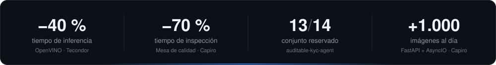

<p align="center">
  
</p>

<p align="center">
  <a href="https://www.linkedin.com/in/juandiegoossa/"></a>
  <a href="mailto:juan.leesin@gmail.com"></a>
  <a href="https://github.com/acromaticodiego?tab=repositories"></a>
</p>

<br>

Construyo **backends que llevan modelos de IA a producción**: APIs, pipelines de
datos y sistemas de visión por computador que trabajan todos los días sobre una
banda transportadora o un flujo de llamadas, no en un notebook.

Más de dos años haciéndolo con Python, Node.js/NestJS, PostgreSQL, Docker y AWS.
Lo que me ocupa ahora son los sistemas que **deciden y se dejan auditar**: que no
devuelvan solo una respuesta, sino el porqué, con la evidencia a la vista para
comprobarla una por una.

<br>

<p align="center">
  
</p>

<br>

## Perfil

```json
{
  "nombre": "Juan Diego Ossa",
  "rol": "Backend & AI Engineer",
  "formacion": "Ingeniería Mecatrónica — ITM, Medellín",
  "ubicacion": "Medellín, Colombia",
  "experiencia": "+2 años",
  "enfoque": ["APIs en producción", "IA agéntica", "visión por computador"],
  "construyendo": "agentes que deciden y explican con evidencia verificable",
  "idiomas": ["Español (nativo)", "Inglés (B1)"]
}
```

## Stack

<table>
  <tr>
    <td valign="top"><b>Backend &amp; APIs</b></td>
    <td>
      
      
      
      
      
      
    </td>
  </tr>
  <tr>
    <td valign="top"><b>Datos</b></td>
    <td>
      
      
      
      
      
      
      
    </td>
  </tr>
  <tr>
    <td valign="top"><b>IA &amp; Visión</b></td>
    <td>
      
      
      
      
      
      
    </td>
  </tr>
  <tr>
    <td valign="top"><b>Cloud &amp; DevOps</b></td>
    <td>
      
      
      
      
      
    </td>
  </tr>
</table>

## Experiencia

**Desarrollador Backend** · Freelance, remoto · <sub>mar 2026 – ago 2026</sub>

Plataforma de recepción y gestión de llamadas de emergencia. Diseñé la
arquitectura backend modular en **NestJS**, la persistencia con **Prisma +
PostgreSQL** y el manejo de estado con **Redis**. Integré la transcripción con
**Deepgram** y modelos **LLM** dentro del flujo de llamada, sobre telefonía
**FreeSWITCH**. Despliegue a producción en **AWS ECS**.

**Ingeniero de Machine Learning y Visión por Computador** · Tecondor S.A.S. · <sub>abr 2025 – feb 2026</sub>

Lideré dos proyectos en campo: el carro de inspección de ramos con cámaras
estereoscópicas (segmentación para conteo de tallos y cálculo de área foliar) y
el conteo de esquejes por bandeja sobre banda transportadora en movimiento.
Pipelines de entrenamiento con **YOLOv8** y **TensorFlow/Keras**, y optimización
con **OpenVINO** que **redujo el tiempo de inferencia un 40 %**.

**Ingeniero de IA y Backend** · Capiro · <sub>oct 2024 – abr 2025</sub>

Lideré la Mesa de Control de Calidad de Esquejes: detección y clasificación en
tiempo real que **recortó un 70 % el tiempo de inspección** manual y automatizó
las métricas morfológicas. APIs asíncronas con **FastAPI + AsyncIO** procesando
**más de 1.000 imágenes diarias**, arquitectura offline-first sobre SQLite
(**consultas 3× más rápidas**) con sincronización contra **AWS S3**.

**Desarrollador Backend** · DEMETEC · <sub>2023</sub>

Sistema de control de calidad con backend en **Flask**, frontend en JavaScript y
visión por computador. Bases SQL y NoSQL (MySQL, MongoDB) afinadas según el tipo
de carga, y automatización de **CI/CD en Linux que bajó los despliegues de horas
a minutos**.

## Proyectos

| Proyecto | Qué resuelve | Resultado medido |
| :--- | :--- | :--- |
| **[auditable-kyc-agent](https://github.com/acromaticodiego/auditable-kyc-agent)** | Un agente que aprueba, rechaza o escala la verificación de una cédula colombiana y justifica la decisión citando señales concretas | **13/14** en un conjunto reservado medido una sola vez, frente a 11/14 de las reglas fijas · **49/49** citas verificadas una a una |
| **[face-snapshot](https://github.com/acromaticodiego/face-snapshot)** | Control de acceso por rostro: detección YOLO, embeddings ArcFace y búsqueda vectorial en PostgreSQL + pgvector, con detección de vida | **0 % APCER y 0 % BPCER** sobre 78 imágenes de prueba · ~300 tests automatizados |
| **[Traffic_Detector](https://github.com/acromaticodiego/Traffic_Detector)** | Detecta accidentes de tránsito en vivo sobre las cámaras de Medellín; rastrea vehículos en metros y confirma el choque por su desenlace | **3 cámaras a 28 fps** simultáneas en una RTX 3050 · 262 tests en 2 s |
| **[avocado_sickness_detection](https://github.com/acromaticodiego/avocado_sickness_detection)** | Clasificación fitosanitaria de aguacate en tiempo real: sano, roña negra o antracnosis | **4,2 fps en la CPU de un portátil**, sin GPU |
| **[banking-voice-agent](https://github.com/acromaticodiego/banking-voice-agent)** | *En curso.* Agente de voz telefónico para verificación de identidad y atención al cliente | Presupuesto objetivo de **800 ms por turno**; sondas de viabilidad publicadas con sus tiempos reales |

<sub>Cada número sale del README del propio repositorio, donde está el tamaño de muestra y cómo se midió.</sub>

## Certificaciones

<sub>
Linux &amp; Shell Scripting · Udemy, 2025 &nbsp;&nbsp;|&nbsp;&nbsp;
MCP — Model Context Protocol · Udemy, 2025 &nbsp;&nbsp;|&nbsp;&nbsp;
Flask, Python &amp; REST API · Udemy, 2025 &nbsp;&nbsp;|&nbsp;&nbsp;
SQL &amp; Databases · Platzi, 2025
</sub>

---

<p align="center">
  <sub>Abierto a oportunidades como Ingeniero de IA / Backend.</sub><br>
  <a href="https://www.linkedin.com/in/juandiegoossa/">LinkedIn</a> ·
  <a href="mailto:juan.leesin@gmail.com">juan.leesin@gmail.com</a>
</p>
